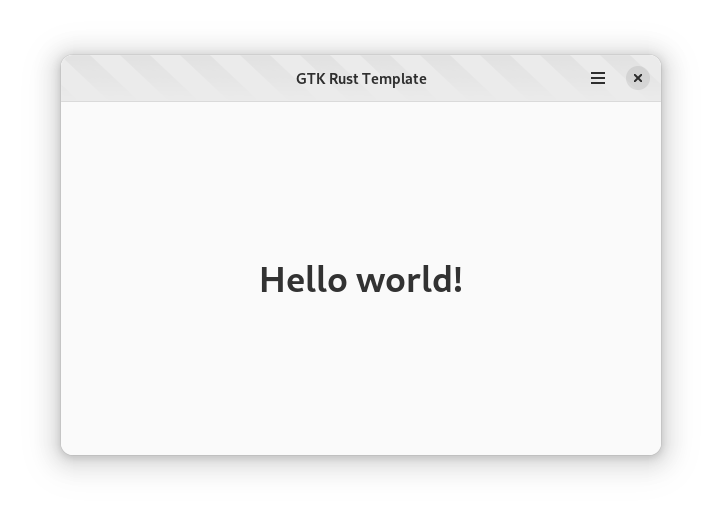

# GTK + Rust + Relm4 + Meson + Flatpak = <3

> This is a fork of [gtk-rust-template](https://github.com/Relm4/relm4-template)

It is improved in may ways to make it easier to make an new project based on this boilerplate project.



## What does it contains?

- A simple window with a headerbar
- Bunch of useful files that you SHOULD ship with your application on Linux:
  - Metainfo: describe your application for the different application stores out there;
  - Desktop: the application launcher;
  - Icons: This repo contains three icons, a normal, a nightly & monochromatic icon (symbolic) per the GNOME HIG, exported using [App Icon Preview](https://flathub.org/apps/details/org.gnome.design.AppIconPreview).
- Flatpak Manifest for nightly builds
- Dual installation support
- Uses Meson for building the application
- Bundles the UI files & the CSS using gresources
- A pre-commit hook to run rustfmt on your code
- Tests to validate your Metainfo, Schemas & Desktop files
- Gsettings to store the window state, more settings could be added
- i18n support
- .spec file for building rpm for Fedora Linux
- New_project.py script to easy create a new project with new name and id.

## Creating a new custom project

`new_project.py` is a tool to create a new project with a custum name and id in at new location.

- All specific files will be renamed and modified to reflect the new name and id etc.
- The new project will be checked into a new git clean project
- A new translation template (.pot) will be created.

### Example

```shell
./new_project.py my_project dk.rasmil.MyApp ~/udv/test/
```

This will create a new project named `my_project`, with the id `dk.rasmil.MyApp` in the `udv/test/my_project` folder

### Requirements (new_project.py)

- Python 3.1x
- xgettext

## Building the project (flatpak)

Make sure you have `make`,  `flatpak` and `flatpak-builder` installed.

```shell
make flatpak-deps
make flatpak
```

## Running the project (flatpak)

```shell
make flatpak-run
```

## Building and running locally from checkout

Run the local.sh script to build and run application locally.

```shell
./local.sh
```

> When running locally you need to install the setting scheme, using
```shell
make install-settings 
```


## Translations with Gettext

The template uses `gettext` as a framework for translations using [`gettext-rs`](https://github.com/gettext-rs/gettext-rs). The basic files for this can be found in the `po` folder.
While meson will take care of building the translations the extraction and translation itself has to be done manually.

### Extracting translatable strings

First of all you have to have `gettext` installed on your system. With that you then are able to use `xgettext` as following to extract the translatable strings:

```shell
xgettext --package-name=my_rust_app --package-version=main --files-from=po/POTFILES.in --output=po/my_rust_app.pot
```

Note that you might need to update the `po/POTFILES.in` file to reflect the files of your process. This describes where `xgettext` is going to search for strings to translate.

### Translating the translatable strings

To translate the strings you need to use po files. Tools like Poedit allow you to generate these from the `po/my_rust_app.pot` file.
It also allows you to sync the `po/my_rust_app.pot` when you rerun `xgettext`.

When adding a po file also make sure to add the language code to `po/LINGUAS`.

## More information

- [Rust](https://rust-lang.org)
- [Relm4](https://relm4.org)
- [Gtk](https://www.gtk.org)
- [Adwaita](https://gnome.pages.gitlab.gnome.org/libadwaita/)
